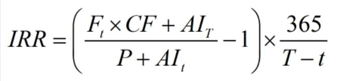
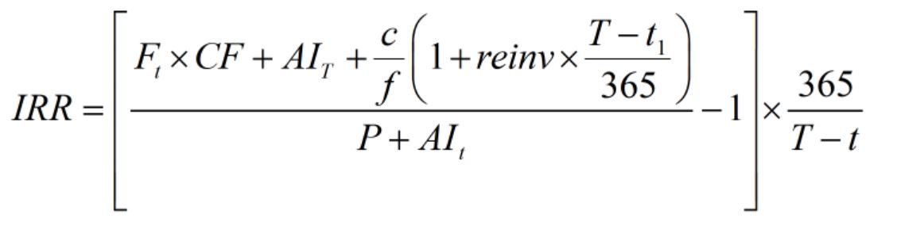
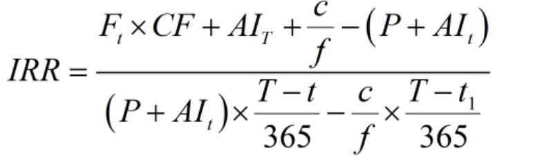

# Tea-Bond Workspace

这是一个 Rust Workspace 项目，包含以下 crate：

- `tea-bond`: 债券相关计算库
- `pybond`: 提供 Python 绑定的库 (默认不包含在构建中)

## IRR计算说明

### <b>Formula:</b>

- 基差（Basis） = 债券净价 - 期货价格 * 转换因子
- 持有收益（Carry） = （交割日应计利息 - 交易日应计利息 + 期间付息） + 资金成本率 * （加权平均期间付息 - 债券全价 * 剩余天数 / 365）
- 净基差（BNOC） = 基差-持有收益
- 发票价格 = 期货价格 * 转换因子 + 交割日应计利息
- 期现利差 = 发票价格- 债券全价 + 期间付息
- 隐含回购利率（IRR）= (发票价格 + 期间付息 - 债券全价)/(债券全价 * 剩余天数 / 365 - 加权平均期间付息)
- qeubee对如上指标的计算公式与fikit一致，其中carry的另一计算公式如下：  
持有收益（carry）= 交割日应计利息 - 交易日应计利息 + 期间付息 + 期间付息再投资 - 期货全价 * 资金成本 * 剩余天数/365

### <b>隐含回购利率（IRR）:</b>
- 如果交割日前没有利息支付，计算公式如下

where:  

F(t)——交易日当天的期货价格；  
AI(T)——交割日应计利息；  
AI(t)——交易日应计利息；  
CF——债券现货的转换因子；  
P——债券在交易日的净价；  

- 如果交割日前有利息支付

where:  
F(t)——交易日当天的期货价格；  
AI(T)——交割日应计利息；  
AI(t)——交易日应计利息；  
CF——债券现货的转换因子；  
P——债券在交易日的净价；  
c——债券年付息；  
f——付息次数；  
t(1)——交割日前利息应付日,该期间付息再投资项根据实际付息次数可加多次；  
reinv——再投资年化收益率。

其中reinv为IRR时

### <b>Reference:</b>
[1]徐亮.国债期货投资策略与实务[M].北京:经济科学出版社,2020:14-15